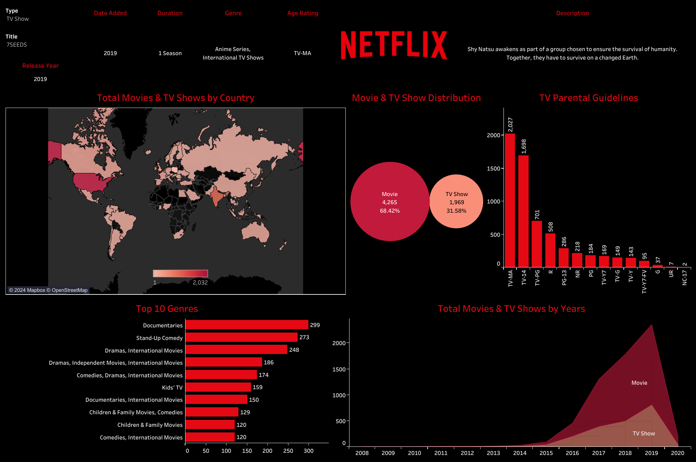
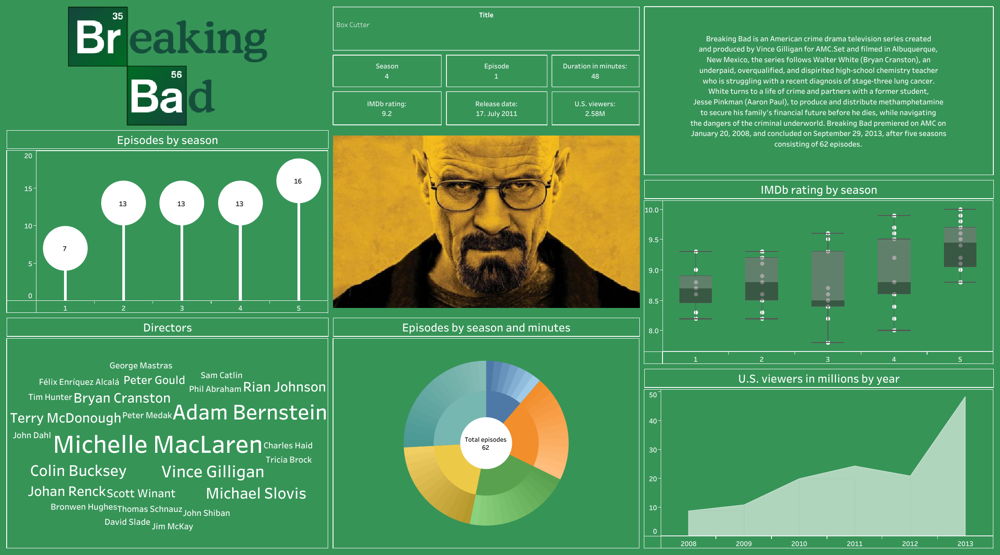
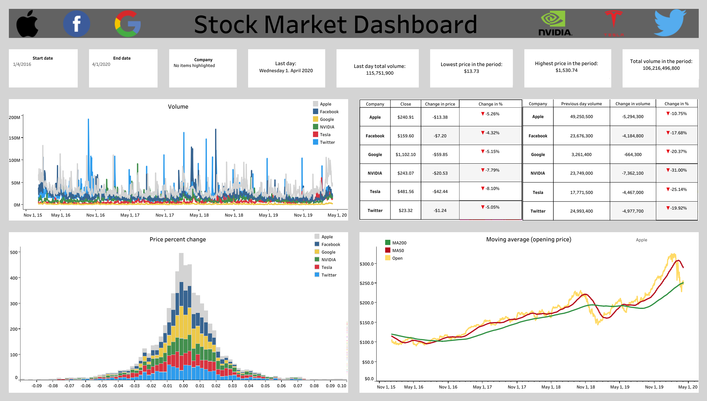

# Some of my Tableau projects
## 🍿 Netflix Dashboard

🔗 [Link to the project](https://public.tableau.com/app/profile/igor.wintner/viz/NetflixDashboard_17104078979880/NetflixDashboard)

- **Title and Overview:** Information about the type, date added, duration, genre, age rating, and release year.

- 🌍 **Total Movies & TV Shows by Country:** World map indicating the number of movies and TV shows by country.

- 📊 **Movie & TV Show Distribution:** Pie chart showing the distribution between movies and TV shows.

- 📺 **TV Parental Guidelines:** Bar chart displaying the count of TV shows by parental guidelines.

- 🎥 **Top 10 Genres:** Bar chart showing the top 10 genres with the highest number of titles.

- 📈 **Total Movies & TV Shows by Years:** Area chart indicating the total number of movies and TV shows over the years.

## 🧪 Breaking Bad Dashboard

🔗 [Link to the project](https://public.tableau.com/app/profile/igor.wintner/viz/breaking_bad_dashboard/Dashboard1)

- **Title and Overview:** Overview of the series, main characters, and a brief summary.

- 💉 **Episodes by Season:** Bubble chart showing the number of episodes in each season.

- 🧬 **Episodes by Season and Minutes:** Sunburst chart displaying the number of episodes and their durations.

- 🔬 **IMDb Rating by Season:** Box plot showing IMDb ratings for each season.

- ⚗️ **Directors:** Word cloud representing the most frequent directors of the series.

- 🧫 **U.S. Viewers in Millions by Year:** Area chart displaying the number of U.S. viewers in millions over the years.

## 📈 Stocks Dashboard

🔗 [Link to the project](https://public.tableau.com/app/profile/igor.wintner/viz/stocks_dashboard/Dashboard)

- **Title and Overview:** Key information about the stock market data, including start and end dates, company names, and significant statistics.

- 📈 **Volume:** Line chart showing the trading volume of stocks over time for different companies.

- 💹 **Price Percent Change:** Histogram displaying the distribution of price changes for various companies.

- 📉 **Moving Average (Opening Price):** Line chart indicating the moving averages of opening prices for different companies (used Python Pandas for creating this).

- 💼 **Stock Data Summary:** Table summarizing key stock data such as closing prices, volume changes, and percentage changes for companies such as Apple, nVidia, Twitter or Tesla.
